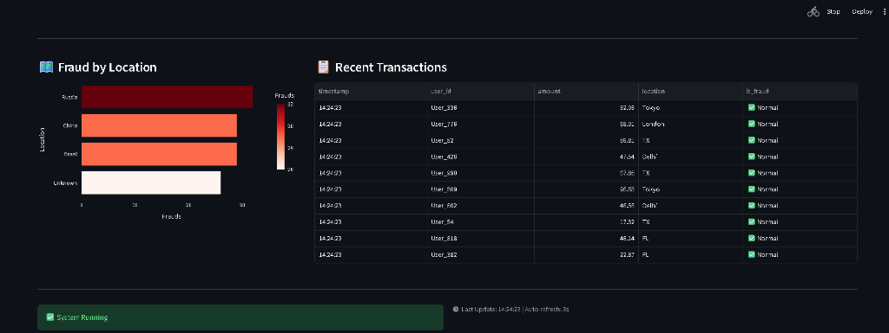
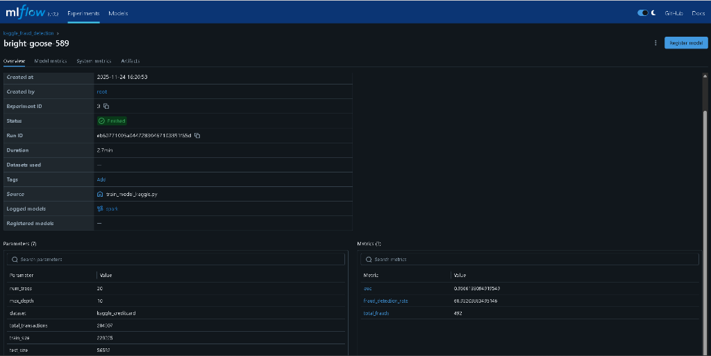
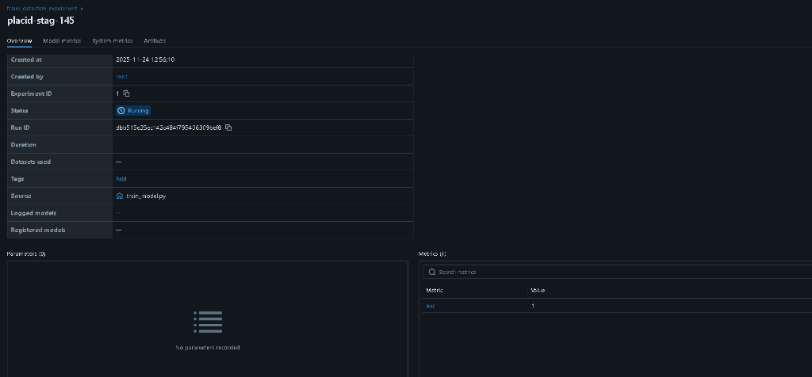

# 🛡️ CreditGuard AI - Real-Time Fraud Detection System

A production-grade, end-to-end machine learning system for detecting credit card fraud in real-time using Apache Spark, Kafka, and MLflow.


## 📊 Live Dashboard

Real-time monitoring dashboard built with Streamlit showing:
- Transaction volume and fraud detection metrics
- Interactive charts (Pie, Line, Bar)

- Geographic fraud distribution

## 📸 Live System Preview

### Real-Time Dashboard



### MLflow Experiment Tracking




## 🏗️ Architecture

```
Producer → Kafka → Spark Streaming → ML Model → Predictions → Dashboard
                      ↓
                    MinIO (S3)
                      ↓
                   MLflow (Model Registry)
```

### Components

- **Data Ingestion**: Kafka for high-throughput streaming
- **Stream Processing**: Apache Spark Structured Streaming
- **ML Framework**: PySpark MLlib (Random Forest Classifier)
- **Model Management**: MLflow for experiment tracking and versioning
- **Storage**: MinIO (S3-compatible object storage)
- **Orchestration**: Apache Airflow (optional)
- **Visualization**: Streamlit dashboard

## 🚀 Features

-  **Real-time fraud detection** with <1 second latency
-  **Multi-source schema mapping** (supports multiple bank formats)
-  **Dual model training** (synthetic + Kaggle dataset)
-  **Model versioning** with MLflow
-  **Interactive dashboard** with live metrics
-  **Scalable architecture** (Kafka + Spark)
-  **Dockerized** for easy deployment

## 📈 Model Performance

| Model | AUC Score | Fraud Detection Rate | Dataset |
|-------|-----------|----------------------|---------|
| Synthetic | ~100% | ~100% | Synthetic (streaming demo) |
| Kaggle | 95.6% | 68.9% | 284K real transactions |

> **Note on Validation:** The synthetic model demonstrates the real-time streaming architecture but is not a rigorous ML validation (trained and tested on same distribution). The **Kaggle model** provides realistic performance metrics on actual credit card fraud data. This project's primary contribution is the **production-grade streaming infrastructure** and **MLOps implementation**, not the ML model itself.

## 🛠️ Tech Stack

**Core:**
- Python 3.9
- Apache Spark 3.4.1
- Apache Kafka 7.4.0
- MLflow 2.7.1
- Streamlit

**Infrastructure:**
- Docker & Docker Compose
- MinIO (S3 storage)


**ML Libraries:**
- PySpark MLlib
- Pandas
- Scikit-learn

## 📦 Installation

### Prerequisites
- Docker Desktop
- Python 3.9+


### Quick Start

1. **Clone the repository**
```bash
git clone https://github.com/YOUR_USERNAME/CreditGuard_AI.git
cd CreditGuard_AI
```

2. **Start all services**
```bash
docker-compose up -d
```

3. **Install Python dependencies**
```bash
pip install -r requirements.txt
```

4. **Initialize MinIO buckets**
```bash
python init_minio.py
```

5. **Start the transaction producer**
```bash
python producer.py
```

6. **Run Spark inference (in new terminal)**
```bash
docker exec -it spark-master /opt/spark/bin/spark-submit \
  --packages org.apache.spark:spark-sql-kafka-0-10_2.12:3.4.1,org.apache.hadoop:hadoop-aws:3.3.4 \
  /opt/spark/spark_inference.py
```


## 🎯 Training Models

### Synthetic Model
Run the training script locally with Spark:
```bash
spark-submit --packages org.apache.hadoop:hadoop-aws:3.3.4 train_model.py
```

### Kaggle Model
```bash
# Upload dataset
python upload_kaggle.py

# Train
docker cp train_model_kaggle.py spark-master:/opt/spark/
docker exec -it spark-master /opt/spark/bin/spark-submit \
  --packages org.apache.hadoop:hadoop-aws:3.3.4 \
  /opt/spark/train_model_kaggle.py
```

## 📁 Project Structure

```
CreditGuard_AI/
├── producer.py                 # Kafka data generator
├── spark_inference.py          # Real-time inference
├── train_model.py              # Synthetic model training
├── train_model_kaggle.py       # Kaggle model training
├── dashboard.py                # Streamlit UI
├── schema_config.py            # Multi-source schema mapping
├── docker-compose.yml          # Infrastructure setup
├── requirements.txt            # Python dependencies
├── SCHEMA_MAPPING_GUIDE.md     # Adding new data sources
└── README.md                   # This file
```

## 🔧 Configuration

### Schema Mapping
To add support for a new bank's data format, edit `schema_config.py`:
```python
SCHEMA_MAPPINGS = {
    "new_bank": {
        "user_id": "customer_id",
        "amount": "transaction_value",
        ...
    }
}
```

See `SCHEMA_MAPPING_GUIDE.md` for detailed instructions.

## 📊 How It Works

1. **Data Generation**: `producer.py` simulates transactions and sends to Kafka
2. **Stream Processing**: Spark reads from Kafka, applies schema mapping
3. **Feature Engineering**: Extracts features (amount, time, location patterns)
4. **Prediction**: ML model predicts fraud (0/1)
5. **Output**: Results sent to Kafka topics and displayed on dashboard

## 🎓 Learning Outcomes

This project demonstrates:
-  Real-time stream processing at scale
-  ML model deployment in production
-  Microservices architecture
-  MLOps best practices
-  Data pipeline orchestration
-  Full-stack development (backend + dashboard)


## 📝 License

MIT License - feel free to use for learning and portfolio purposes.

**Note:** The original `creditcard.csv` dataset (≈ XX MB) is not included in this repository due to GitHub's file‑size limit. You can download it from the Kaggle dataset or from the MinIO bucket used by the project.
---

** If this project helped you, please give it a star!**
